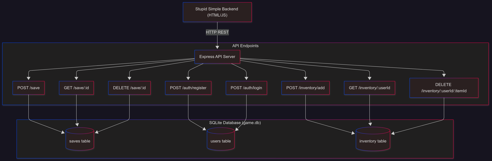

# Stupid Simple Backend

[](https://github.com/MirkoSon/SSBackend/actions)
[](https://github.com/MirkoSon/SSBackend/releases)

---

## 📖 Overview

The **Stupid Simple Backend** is a lightweight, standalone backend service for **game prototyping**.

It provides:

* **Save/Load** endpoints for arbitrary JSON game state
* **Simple authentication** (register/login)
* **Inventory management**
* Packaged as a single executable → **no Node.js required**

Designed to be **stupid simple**: built for designers/prototypers to iterate fast, without worrying about real backend setup, DB corruption, or cloud deployments.

---

## 🚀 Features

* ✅ Save & load JSON game state
* ✅ Basic authentication (register/login with JWT)
* ✅ Simple inventory endpoints (add/get/delete)
* ✅ SQLite persistence in `game.db`
* ✅ One-click reset (delete `game.db`)
* ✅ Executables for Windows & macOS/Linux

---

## 📥 Downloads

* Latest Windows build: [Download](https://github.com/MirkoSon/SSBackend/releases/download/v1.0.3/ssbackend.exe)
* Latest macOS build: [Download](https://github.com/MirkoSon/SSBackend/releases/download/v1.0.3/ssbackend-macos)
* Latest Linux build: [Download](https://github.com/MirkoSon/SSBackend/releases/download/v1.0.3/ssbackend-linux)

*(These links auto-update on each release)*

---

## 🛠️ Usage

1. **Download** the executable for your OS from the links above.

2. **Run** it from the terminal:

   ```bash
   # Default port (3000)
   ./ssbackend   # macOS/Linux
   ssbackend.exe # Windows
   
   # Custom port using --port parameter
   ./ssbackend --port 8080
   ssbackend.exe --port 8080
   
   # Custom port using environment variable
   PORT=8080 ./ssbackend
   set PORT=8080 && ssbackend.exe
   
   # Get help information
   ./ssbackend --help
   ```

3. **Test endpoints** from your game prototype or with curl/Postman:

   * Health check:

     ```bash
     curl http://localhost:3000/health
     ```

   * Save game state:

     ```bash
     curl -X POST http://localhost:3000/save \
       -H "Content-Type: application/json" \
       -d '{"id":"test1","data":{"score":42}}'
     ```

   * Load game state:

     ```bash
     curl http://localhost:3000/save/test1
     ```

   * Register & login:

     ```bash
     curl -X POST http://localhost:3000/auth/register \
       -H "Content-Type: application/json" \
       -d '{"username":"alice","password":"secret"}'
     ```

   * Add inventory item:

     ```bash
     curl -X POST http://localhost:3000/inventory/add \
       -H "Content-Type: application/json" \
       -H "Authorization: Bearer <token>" \
       -d '{"userId":1,"itemId":"sword","quantity":1}'
     ```

4. **Reset database** by deleting the `game.db` file created in the working directory.

---

## 📖 Port Configuration

The backend simulator supports flexible port configuration:

- **Default**: Runs on port 3000
- **CLI Parameter**: Use `--port <number>` to specify a custom port
- **Environment Variable**: Set `PORT=<number>` before running
- **Priority**: CLI parameter > Environment variable > Default (3000)

Examples:
```bash
# Default port 3000
./ssbackend

# Custom port via CLI
./ssbackend --port 8080

# Custom port via environment
PORT=9000 ./ssbackend

# Invalid ports will show an error
./ssbackend --port 70000  # Error: Port must be between 1-65535
```

---

## 🔧 Troubleshooting

### Common Issues

**Database errors:**
- **Problem**: `SQLITE_CANTOPEN: unable to open database file`
- **Solution**: Ensure the executable has write permissions in the working directory

**Port conflicts:**
- **Problem**: `Error: listen EADDRINUSE :::3000`
- **Solution**: Use `--port <number>` to choose a different port or stop other services using port 3000

**Reset database:**
- Delete the `game.db` file in the working directory
- The file will be recreated automatically on next startup

**Executable security warnings:**
- **Windows**: Windows Defender may flag the executable as unknown software
- **macOS**: You may need to allow the app in System Preferences > Security & Privacy
- **Linux**: Ensure the executable has execute permissions: `chmod +x ssbackend`

### Performance Notes

- Database file size grows with save data - delete `game.db` to reset
- Executable size: ~45MB (includes Node.js runtime and dependencies)
- Memory usage: ~50-100MB during operation
- Startup time: ~2-3 seconds (includes database initialization)

---

## 🗄️ Architecture



---

## 🔧 Development

Clone the repo and install dependencies:

```bash
git clone https://github.com/MirkoSon/SSBackend.git
cd SSBackend
npm install
```

### Security Documentation

For detailed information about the authentication system's security implementation, see:
- [Authentication Security Notes](docs/security/auth-security-notes.md) - Security features, production considerations, and audit recommendations

Run locally (requires Node.js):

```bash
npm start                # Default port 3000
npm start -- --port 8080 # Custom port
```

Build executables manually:

```bash
# Build Windows executable
npm run build:exe

# Build Linux/macOS executables
npm run build:bin

# Build all platforms
npm run build:all

# Test built executable
npm run test:exe
```

Available scripts:
- `npm start` - Run development server
- `npm run dev` - Run with nodemon for auto-restart
- `npm run build:exe` - Build Windows executable
- `npm run build:bin` - Build Linux/macOS executables
- `npm run build:all` - Build all platform executables
- `npm run test:exe` - Test Windows executable
- `npm run test:bin` - Test Linux/macOS executable

---

## ⚡ CI/CD

This repo uses **GitHub Actions** to:

* Build `.exe` and `.bin` executables for Windows, macOS, Linux
* Publish them to GitHub Releases on every tag push (`v1.0.0`, `v1.1.0`, etc.)
* Update README download links automatically

---

## 📜 License

MIT License.
