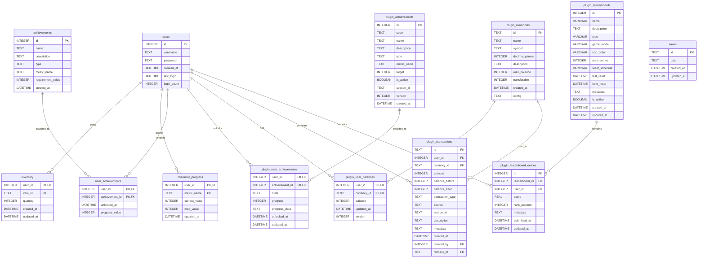

# SSBackend Database Schema

This document provides a comprehensive overview of the complete database schema for the SSBackend project, including core tables and plugin-specific tables.

---

## Core Schema

The core schema provides fundamental functionality for user management, game saves, inventory, character progression, and achievements.

### `saves`
Stores game save data.

| Column | Type | Constraints | Description |
|--------|------|-------------|-------------|
| `id` | TEXT | PRIMARY KEY | Unique save identifier |
| `data` | TEXT | NOT NULL | Serialized save data |
| `created_at` | DATETIME | DEFAULT CURRENT_TIMESTAMP | Save creation timestamp |
| `updated_at` | DATETIME | DEFAULT CURRENT_TIMESTAMP | Last update timestamp |

---

### `users`
User authentication and session tracking.

| Column | Type | Constraints | Description |
|--------|------|-------------|-------------|
| `id` | INTEGER | PRIMARY KEY AUTOINCREMENT | Unique user identifier |
| `username` | TEXT | UNIQUE NOT NULL | User's login name |
| `password` | TEXT | NOT NULL | Hashed password |
| `created_at` | DATETIME | DEFAULT CURRENT_TIMESTAMP | Account creation timestamp |
| `last_login` | DATETIME | | Last login timestamp |
| `login_count` | INTEGER | DEFAULT 0 | Total number of logins |

---

### `inventory`
User inventory items with quantities.

| Column | Type | Constraints | Description |
|--------|------|-------------|-------------|
| `user_id` | INTEGER | PRIMARY KEY (with item_id), FK → users(id) ON DELETE CASCADE | User identifier |
| `item_id` | TEXT | PRIMARY KEY (with user_id) | Item identifier |
| `quantity` | INTEGER | DEFAULT 1 | Item quantity |
| `created_at` | DATETIME | DEFAULT CURRENT_TIMESTAMP | Item acquisition timestamp |
| `updated_at` | DATETIME | DEFAULT CURRENT_TIMESTAMP | Last update timestamp |

**Composite Primary Key:** (`user_id`, `item_id`)

---

### `character_progress`
Tracks user progress metrics (level, experience, play time, etc.).

| Column | Type | Constraints | Description |
|--------|------|-------------|-------------|
| `user_id` | INTEGER | PRIMARY KEY (with metric_name), FK → users(id) ON DELETE CASCADE | User identifier |
| `metric_name` | TEXT | PRIMARY KEY (with user_id) | Metric name (e.g., 'level', 'experience') |
| `current_value` | INTEGER | DEFAULT 0 | Current metric value |
| `max_value` | INTEGER | DEFAULT NULL | Maximum value (if applicable) |
| `updated_at` | DATETIME | DEFAULT CURRENT_TIMESTAMP | Last update timestamp |

**Composite Primary Key:** (`user_id`, `metric_name`)

---

### `achievements`
Achievement definitions (legacy core table).

| Column | Type | Constraints | Description |
|--------|------|-------------|-------------|
| `id` | INTEGER | PRIMARY KEY AUTOINCREMENT | Unique achievement identifier |
| `name` | TEXT | UNIQUE NOT NULL | Achievement name |
| `description` | TEXT | NOT NULL | Achievement description |
| `type` | TEXT | NOT NULL | Type: 'score', 'progress', 'event' |
| `metric_name` | TEXT | | Progress metric to check |
| `requirement_value` | INTEGER | | Value needed to unlock |
| `created_at` | DATETIME | DEFAULT CURRENT_TIMESTAMP | Achievement creation timestamp |

---

### `user_achievements`
User achievement unlocks (legacy core table).

| Column | Type | Constraints | Description |
|--------|------|-------------|-------------|
| `user_id` | INTEGER | PRIMARY KEY (with achievement_id), FK → users(id) ON DELETE CASCADE | User identifier |
| `achievement_id` | INTEGER | PRIMARY KEY (with user_id), FK → achievements(id) ON DELETE CASCADE | Achievement identifier |
| `unlocked_at` | DATETIME | DEFAULT CURRENT_TIMESTAMP | Unlock timestamp |
| `progress_value` | INTEGER | | Value when achievement was earned |

**Composite Primary Key:** (`user_id`, `achievement_id`)

---

## Plugin Schemas

### Achievements Plugin

The Achievements plugin provides a modern, feature-rich achievement system with progress tracking and state management.

#### `plugin_achievements`
Achievement definitions for the plugin system.

| Column | Type | Constraints | Description |
|--------|------|-------------|-------------|
| `id` | INTEGER | PRIMARY KEY AUTOINCREMENT | Unique achievement identifier |
| `code` | TEXT | UNIQUE NOT NULL | Unique achievement code |
| `name` | TEXT | NOT NULL | Achievement name |
| `description` | TEXT | NOT NULL | Achievement description |
| `type` | TEXT | NOT NULL | Achievement type |
| `metric_name` | TEXT | | Metric to track |
| `target` | INTEGER | NOT NULL | Target value to unlock |
| `is_active` | BOOLEAN | DEFAULT 1 | Whether achievement is active |
| `season_id` | TEXT | | Optional season identifier |
| `version` | INTEGER | DEFAULT 1 | Achievement version |
| `created_at` | DATETIME | DEFAULT CURRENT_TIMESTAMP | Creation timestamp |

---

#### `plugin_user_achievements`
User achievement progress and unlocks.

| Column | Type | Constraints | Description |
|--------|------|-------------|-------------|
| `user_id` | INTEGER | PRIMARY KEY (with achievement_id), FK → users(id) ON DELETE CASCADE | User identifier |
| `achievement_id` | INTEGER | PRIMARY KEY (with user_id), FK → plugin_achievements(id) ON DELETE CASCADE | Achievement identifier |
| `state` | TEXT | NOT NULL DEFAULT 'locked' | State: 'locked', 'in_progress', 'unlocked' |
| `progress` | INTEGER | DEFAULT 0 | Current progress value |
| `progress_data` | TEXT | | Additional progress data (JSON) |
| `unlocked_at` | DATETIME | | Unlock timestamp |
| `updated_at` | DATETIME | DEFAULT CURRENT_TIMESTAMP | Last update timestamp |

**Composite Primary Key:** (`user_id`, `achievement_id`)

---

### Economy Plugin

The Economy plugin manages virtual currencies, user balances, and transaction history.

#### `plugin_currencies`
Currency definitions.

| Column | Type | Constraints | Description |
|--------|------|-------------|-------------|
| `id` | TEXT | PRIMARY KEY | Unique currency identifier |
| `name` | TEXT | NOT NULL | Currency name |
| `symbol` | TEXT | | Currency symbol |
| `decimal_places` | INTEGER | DEFAULT 0 | Number of decimal places |
| `description` | TEXT | | Currency description |
| `max_balance` | INTEGER | DEFAULT -1 | Maximum balance (-1 = unlimited) |
| `transferable` | INTEGER | DEFAULT 1 | Whether currency can be transferred |
| `created_at` | DATETIME | DEFAULT CURRENT_TIMESTAMP | Creation timestamp |
| `config` | TEXT | | Additional configuration (JSON) |

---

#### `plugin_user_balances`
User balance tracking for each currency.

| Column | Type | Constraints | Description |
|--------|------|-------------|-------------|
| `user_id` | INTEGER | PRIMARY KEY (with currency_id), FK → users(id) ON DELETE CASCADE | User identifier |
| `currency_id` | TEXT | PRIMARY KEY (with user_id), FK → plugin_currencies(id) | Currency identifier |
| `balance` | INTEGER | NOT NULL DEFAULT 0, CHECK (balance >= 0) | Current balance |
| `updated_at` | DATETIME | DEFAULT CURRENT_TIMESTAMP | Last update timestamp |
| `version` | INTEGER | DEFAULT 1 | Version for optimistic locking |

**Composite Primary Key:** (`user_id`, `currency_id`)

**Indexes:**
- `idx_user_balances` on (`user_id`)
- `idx_balance_currency` on (`currency_id`, `balance DESC`)

---

#### `plugin_transactions`
Complete transaction history with audit trail.

| Column | Type | Constraints | Description |
|--------|------|-------------|-------------|
| `id` | TEXT | PRIMARY KEY | Unique transaction identifier |
| `user_id` | INTEGER | NOT NULL, FK → users(id) ON DELETE CASCADE | User identifier |
| `currency_id` | TEXT | NOT NULL, FK → plugin_currencies(id) | Currency identifier |
| `amount` | INTEGER | NOT NULL | Transaction amount (positive or negative) |
| `balance_before` | INTEGER | NOT NULL | Balance before transaction |
| `balance_after` | INTEGER | NOT NULL | Balance after transaction |
| `transaction_type` | TEXT | NOT NULL | Type: 'credit', 'debit', 'transfer', etc. |
| `source` | TEXT | NOT NULL | Transaction source/reason |
| `source_id` | TEXT | | Optional source identifier |
| `description` | TEXT | | Human-readable description |
| `metadata` | TEXT | | Additional metadata (JSON) |
| `created_at` | DATETIME | DEFAULT CURRENT_TIMESTAMP | Transaction timestamp |
| `created_by` | INTEGER | FK → users(id) | Admin who created transaction |
| `rollback_of` | TEXT | FK → plugin_transactions(id) | If this is a rollback, original transaction ID |

**Indexes:**
- `idx_user_transactions` on (`user_id`, `created_at DESC`)
- `idx_transaction_type` on (`transaction_type`, `created_at DESC`)
- `idx_currency_transactions` on (`currency_id`, `created_at DESC`)
- `idx_transaction_source` on (`source`, `created_at DESC`)

---

### Leaderboards Plugin

The Leaderboards plugin manages competitive rankings with support for different game modes and reset schedules.

#### `plugin_leaderboards`
Leaderboard definitions.

| Column | Type | Constraints | Description |
|--------|------|-------------|-------------|
| `id` | INTEGER | PRIMARY KEY AUTOINCREMENT | Unique leaderboard identifier |
| `name` | VARCHAR(255) | NOT NULL, UNIQUE (with game_mode) | Leaderboard name |
| `description` | TEXT | | Leaderboard description |
| `type` | VARCHAR(50) | NOT NULL DEFAULT 'all_time' | Type: 'all_time', 'daily', 'weekly', etc. |
| `game_mode` | VARCHAR(100) | UNIQUE (with name) | Game mode identifier |
| `sort_order` | VARCHAR(10) | NOT NULL DEFAULT 'DESC' | Sort order: 'ASC' or 'DESC' |
| `max_entries` | INTEGER | DEFAULT 10000 | Maximum number of entries |
| `reset_schedule` | VARCHAR(50) | | Reset schedule (e.g., 'daily', 'weekly') |
| `last_reset` | DATETIME | | Last reset timestamp |
| `next_reset` | DATETIME | | Next scheduled reset |
| `metadata` | TEXT | | Additional metadata (JSON) |
| `is_active` | BOOLEAN | DEFAULT 1 | Whether leaderboard is active |
| `created_at` | DATETIME | DEFAULT CURRENT_TIMESTAMP | Creation timestamp |
| `updated_at` | DATETIME | DEFAULT CURRENT_TIMESTAMP | Last update timestamp |

**Unique Constraint:** (`name`, `game_mode`)

**Indexes:**
- `idx_leaderboards_type` on (`type`, `is_active`)
- `idx_leaderboards_reset` on (`next_reset`) WHERE `next_reset IS NOT NULL`

---

#### `plugin_leaderboard_entries`
User scores and rankings.

| Column | Type | Constraints | Description |
|--------|------|-------------|-------------|
| `id` | INTEGER | PRIMARY KEY AUTOINCREMENT | Unique entry identifier |
| `leaderboard_id` | INTEGER | NOT NULL, FK → plugin_leaderboards(id) ON DELETE CASCADE, UNIQUE (with user_id) | Leaderboard identifier |
| `user_id` | INTEGER | NOT NULL, FK → users(id) ON DELETE CASCADE, UNIQUE (with leaderboard_id) | User identifier |
| `score` | REAL | NOT NULL | User's score |
| `rank_position` | INTEGER | | Calculated rank position |
| `metadata` | TEXT | | Additional metadata (JSON) |
| `submitted_at` | DATETIME | DEFAULT CURRENT_TIMESTAMP | Initial submission timestamp |
| `updated_at` | DATETIME | DEFAULT CURRENT_TIMESTAMP | Last update timestamp |

**Unique Constraint:** (`leaderboard_id`, `user_id`)

**Indexes:**
- `idx_leaderboard_entries_score` on (`leaderboard_id`, `score DESC`, `submitted_at ASC`)
- `idx_leaderboard_entries_user` on (`user_id`)
- `idx_leaderboard_entries_rank` on (`leaderboard_id`, `rank_position`)

---

## Database Technology

- **Database Engine:** SQLite3
- **Location:** `e:\GIT\SSBackend\game.db` (main database)
- **Migration System:** Custom migration system with versioned migration files

---

## Migration Files

### Core Migrations
- [000001_core_schema.js](file:///e:/GIT/SSBackend/src/db/migrations/000001_core_schema.js) - Initial core tables

### Plugin Migrations
- [Achievements: 000001_initial_schema.js](file:///e:/GIT/SSBackend/plugins/@core/achievements/migrations/000001_initial_schema.js)
- [Economy: 000001_initial_schema.js](file:///e:/GIT/SSBackend/plugins/@core/economy/migrations/000001_initial_schema.js)
- [Leaderboards: 000001_initial_schema.js](file:///e:/GIT/SSBackend/plugins/@core/leaderboards/migrations/000001_initial_schema.js)

---

## Entity Relationship Overview

---

## Notes

### Legacy vs Plugin Tables
- **Legacy Achievement Tables:** `achievements` and `user_achievements` are part of the core schema and may be deprecated in favor of the plugin system.
- **Plugin Tables:** All tables prefixed with `plugin_` are managed by their respective plugins and follow a modular architecture.

### Data Types
- **TEXT:** Used for strings and JSON-serialized data
- **INTEGER:** Used for whole numbers and foreign keys
- **REAL:** Used for floating-point numbers (scores)
- **DATETIME:** SQLite datetime format (ISO 8601)
- **BOOLEAN:** Stored as INTEGER (0 or 1)

### Foreign Key Constraints
All foreign key relationships use `ON DELETE CASCADE` to maintain referential integrity when users or parent records are deleted.

### Performance Considerations
- Indexes are strategically placed on frequently queried columns
- Composite indexes support common query patterns (e.g., user + timestamp)
- The `version` column in `plugin_user_balances` enables optimistic locking for concurrent updates
